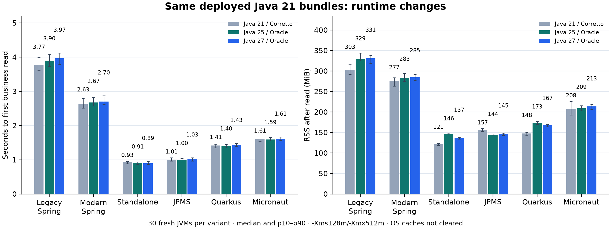
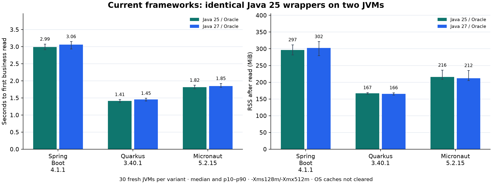
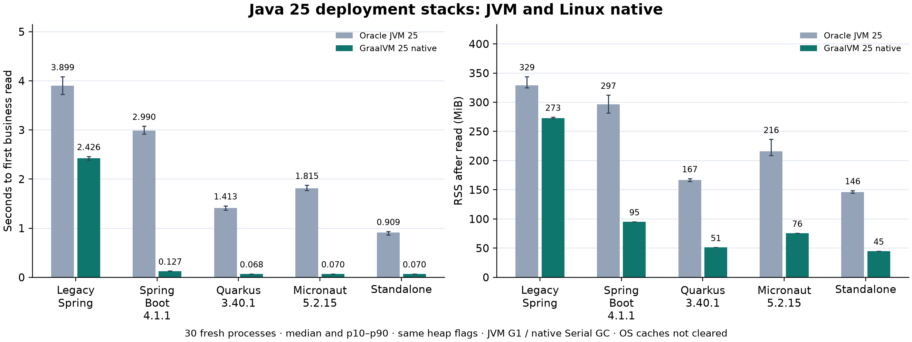

# Java 25 / Java 27 comprehensive benchmark

This report keeps runtime replacement, framework upgrade and native compilation as separate experiments. All observations use the same isolated persisted Merchant Q/E/read/update contract, lazy ten-connection pools and explicit execution logging disabled. Heap flags are -Xms128m/-Xmx512m; OS caches are not cleared. Thirty fresh starts and five bounded fixed-warmup samples are required for each reported variant.

## Operating environment

Table guide: ↓ lower is better; ↑ higher is better. ①/②/③ mark the three best distinct displayed values within each table; displayed ties share a rank. Paired p50/p95 values are ranked separately. Thread counts are descriptive. These marks do not imply statistical significance or an overall framework ranking.

| Component | Configuration |
| --- | --- |
| OS / architecture | Debian GNU/Linux 13 (trixie), Debian version 13.7; x86_64 |
| Linux kernel | 6.12.107+deb13-amd64 |
| CPU | Intel Core i7-4770HQ @ 2.20 GHz; 1 socket, 4 physical cores / 8 logical CPUs |
| Memory | 15.50 GiB usable (16,646,144,000 bytes reported by Linux) |
| Storage | APPLE SSD SM0256G, SSD; 233.8 GiB physical capacity |
| Benchmark filesystem | ext4 on /dev/sda6, mounted at /home; 189.3 GiB filesystem capacity |

Application JVMs/native executables and the Python HTTP load generator run on this same host. PostgreSQL 17.11 runs in Docker and is accessed over loopback; Redis 7.4.11 is installed but not exercised by this workload. Other services share the host. CPU affinity and frequency are not pinned, and OS caches are not cleared. No disk throughput or IOPS measurement is claimed.

[Host inventory](host-environment.json) was collected at 2026-10-10T06:14:54Z. Its 166.4 GiB available filesystem space is a post-campaign snapshot, not a measurement throughout the runs. Per-batch environment and toolchain records remain linked below.

## Existing framework bundles, new JVMs

Completed raw batch: `results-20261010-092356`.

| Variant | HTTP ready (s) ↓ | Business ready (s) ↓ | Business RSS (MiB) ↓ | Settled RSS (MiB) ↓ | Warm read req/s ↑ | Warm write req/s ↑ |
| --- | ---: | ---: | ---: | ---: | ---: | ---: |
| legacy-spring-jdk25 | 3.681 | 3.899 | 329.0 | 334.9 | 197.9 | 50.5 |
| modern-spring-jdk25 | 2.434 | 2.672 | 283.5 | 293.2 | 204.4 | 49.6 |
| modern-classpath-jdk25 | 0.603 ① | 0.909 ② | 146.2 | 181.3 | 209.1 ③ | 52.9 ① |
| modern-jpms-jdk25 | 0.718 ③ | 0.998 ③ | 144.3 ② | 178.2 ③ | 216.6 ① | 50.7 |
| modern-quarkus-jdk25 | 1.131 | 1.395 | 173.1 | 209.3 | 205.8 | 52.6 ② |
| modern-micronaut-jdk25 | 1.322 | 1.593 | 209.0 | 226.3 | 205.3 | 50.0 |
| legacy-spring-jdk27 | 3.730 | 3.968 | 330.9 | 336.6 | 194.3 | 49.4 |
| modern-spring-jdk27 | 2.466 | 2.699 | 284.8 | 294.3 | 202.7 | 48.5 |
| modern-classpath-jdk27 | 0.608 ② | 0.895 ① | 136.6 ① | 171.8 ① | 206.6 | 50.3 |
| modern-jpms-jdk27 | 0.742 | 1.029 | 145.4 ③ | 172.5 ② | 213.6 ② | 47.6 |
| modern-quarkus-jdk27 | 1.169 | 1.429 | 167.1 | 195.7 | 200.8 | 51.8 ③ |
| modern-micronaut-jdk27 | 1.346 | 1.610 | 213.4 | 228.5 | 197.6 | 48.0 |

| Variant | First read (ms) ↓ | First update to 49 (ms) ↓ | Warm read p95 (ms) ↓ | Warm write p95 (ms) ↓ | CPU by business readiness (s) ↓ | Threads after read (descriptive) |
| --- | ---: | ---: | ---: | ---: | ---: | ---: |
| legacy-spring-jdk25 | 226.6 ② | 40.8 ① | 43.8 ② | 20.9 ③ | 15.04 | 45 |
| modern-spring-jdk25 | 241.7 | 62.3 | 31.7 ① | 26.1 | 9.88 | 45 |
| modern-classpath-jdk25 | 290.9 | 66.1 | 44.0 ③ | 20.4 ① | 2.10 ① | 33 |
| modern-jpms-jdk25 | 271.8 | 62.4 | 47.3 | 22.4 | 2.58 ③ | 28 |
| modern-quarkus-jdk25 | 258.3 | 63.8 | 63.2 | 22.5 | 3.25 | 44 |
| modern-micronaut-jdk25 | 265.0 | 65.0 | 54.9 | 20.4 ① | 4.59 | 42 |
| legacy-spring-jdk27 | 225.4 ① | 42.0 ② | 66.8 | 21.5 | 15.45 | 46 |
| modern-spring-jdk27 | 235.6 ③ | 60.4 ③ | 50.5 | 25.0 | 10.28 | 46 |
| modern-classpath-jdk27 | 283.4 | 78.9 | 51.4 | 20.7 ② | 2.12 ② | 25 |
| modern-jpms-jdk27 | 278.3 | 68.5 | 50.1 | 26.4 | 2.74 | 33 |
| modern-quarkus-jdk27 | 263.0 | 66.5 | 55.0 | 24.6 | 3.41 | 46 |
| modern-micronaut-jdk27 | 263.4 | 65.9 | 59.1 | 24.6 | 4.79 | 44 |

Warm p95 columns are medians across the five load samples of each sample’s p95. First-read/update columns are medians across 30 fresh starts. CPU is process CPU accumulated by the first successful business read.

[Startup CSV](results-20261010-092356/startup.csv), [load CSV](results-20261010-092356/load.csv), [environment](results-20261010-092356/environment.json).

Bars show medians; whiskers show p10–p90 of 30 observations, not confidence intervals. The historical Java 21 distribution differs from the Oracle 25/27 pair.

## Current framework wrappers, new JVMs

Completed raw batch: `current-results-20261010-104637`.

| Variant | HTTP ready (s) ↓ | Business ready (s) ↓ | Business RSS (MiB) ↓ | Settled RSS (MiB) ↓ | Warm read req/s ↑ | Warm write req/s ↑ |
| --- | ---: | ---: | ---: | ---: | ---: | ---: |
| current-spring-jdk25 | 2.744 | 2.990 | 296.5 | 320.1 | 209.6 ① | 47.1 |
| current-quarkus-jdk25 | 1.143 ① | 1.413 ① | 166.8 ② | 203.0 ② | 204.9 | 51.8 ② |
| current-micronaut-jdk25 | 1.539 ③ | 1.815 ③ | 216.0 | 236.4 | 205.9 ② | 48.1 |
| current-spring-jdk27 | 2.797 | 3.058 | 302.2 | 318.4 | 198.7 | 50.3 ③ |
| current-quarkus-jdk27 | 1.175 ② | 1.454 ② | 165.6 ① | 192.7 ① | 205.3 ③ | 52.6 ① |
| current-micronaut-jdk27 | 1.567 | 1.849 | 212.2 ③ | 231.0 ③ | 201.8 | 48.4 |

| Variant | First read (ms) ↓ | First update to 49 (ms) ↓ | Warm read p95 (ms) ↓ | Warm write p95 (ms) ↓ | CPU by business readiness (s) ↓ | Threads after read (descriptive) |
| --- | ---: | ---: | ---: | ---: | ---: | ---: |
| current-spring-jdk25 | 247.9 ① | 62.5 | 47.1 ② | 25.3 | 10.82 | 45 |
| current-quarkus-jdk25 | 263.6 ③ | 67.0 | 52.6 | 21.3 ③ | 3.06 ① | 42 |
| current-micronaut-jdk25 | 282.8 | 62.1 ② | 35.2 ① | 23.7 | 5.00 ③ | 42 |
| current-spring-jdk27 | 252.4 ② | 61.9 ① | 54.9 | 21.1 ② | 11.48 | 46 |
| current-quarkus-jdk27 | 268.4 | 69.8 | 48.1 ③ | 20.7 ① | 3.31 ② | 44 |
| current-micronaut-jdk27 | 287.1 | 62.3 ③ | 49.1 | 25.9 | 5.20 | 44 |

Warm p95 columns are medians across the five load samples of each sample’s p95. First-read/update columns are medians across 30 fresh starts. CPU is process CPU accumulated by the first successful business read.

[Startup CSV](current-results-20261010-104637/startup.csv), [load CSV](current-results-20261010-104637/load.csv), [environment](current-results-20261010-104637/environment.json).

Both JVMs run identical Java 25 wrappers. Micronaut labels identify its core version; the platform version is 5.2.2.

## Current/legacy native deployment stacks, GraalVM 25

Completed raw batch: `native25/results-20261010-125259`.

| Variant | HTTP ready (s) ↓ | Business ready (s) ↓ | Business RSS (MiB) ↓ | Settled RSS (MiB) ↓ | Warm read req/s ↑ | Warm write req/s ↑ |
| --- | ---: | ---: | ---: | ---: | ---: | ---: |
| standalone | 0.042 ② | 0.070 ② | 45.0 ① | 48.1 ① | 236.3 ① | 59.1 ③ |
| spring | 0.099 ③ | 0.127 ③ | 95.3 | 98.4 | 229.2 ③ | 55.5 |
| quarkus | 0.040 ① | 0.068 ① | 51.2 ② | 54.5 ② | 224.7 | 61.2 ① |
| micronaut | 0.042 ② | 0.070 ② | 75.7 ③ | 78.8 ③ | 229.7 ② | 59.4 ② |
| legacy | 2.397 | 2.426 | 272.9 | 273.0 | 223.8 | 54.6 |

| Variant | First read (ms) ↓ | First update to 49 (ms) ↓ | Warm read p95 (ms) ↓ | Warm write p95 (ms) ↓ | CPU by business readiness (s) ↓ | Threads after read (descriptive) |
| --- | ---: | ---: | ---: | ---: | ---: | ---: |
| standalone | 27.6 ① | 17.1 ① | 57.1 ③ | 18.1 ③ | 0.02 ① | 9 |
| spring | 27.9 ③ | 17.5 ③ | 60.1 | 17.6 ② | 0.08 | 20 |
| quarkus | 28.1 | 17.4 ② | 58.6 | 17.3 ① | 0.03 ② | 17 |
| micronaut | 27.8 ② | 17.9 | 31.8 ① | 17.3 ① | 0.04 ③ | 17 |
| legacy | 29.1 | 17.8 | 56.7 ② | 18.9 | 2.36 | 20 |

Warm p95 columns are medians across the five load samples of each sample’s p95. First-read/update columns are medians across 30 fresh starts. CPU is process CPU accumulated by the first successful business read.

[Startup CSV](native25/results-20261010-125259/startup.csv), [load CSV](native25/results-20261010-125259/load.csv), [environment](native25/results-20261010-125259/environment.json).

| Native variant | Executable (MiB) ↓ | Build elapsed ↓ | Compiler peak RSS (MiB) ↓ |
| --- | ---: | ---: | ---: |
| standalone | 56.1 ① | 3:21.85 ① | 4254.9 ② |
| spring | 93.4 | 5:00.24 | 5374.3 |
| quarkus | 59.5 ② | 3:32.62 ② | 3683.2 ① |
| micronaut | 87.9 ③ | 4:26.25 ③ | 4530.7 ③ |
| legacy | 130.9 | 6:09.11 | 6666.3 |

[Native build provenance](native25/build-provenance.json). Build cost describes the successful configured attempt; failed attempts are retained separately.

Native/JVM comparisons include framework AOT and native-specific integration. The legacy adapter registers its existing SQL parsers explicitly. G1 and Serial GC differ.

## Interpretation

For unchanged bundles, replacing Oracle Java 25 with 27 changed median business readiness by -1.5% to +3.1%. The observed matrix does not show a universal startup acceleration. These are deployment observations from one shared host, not a prediction for other services.

For upgraded framework wrappers, replacing Oracle Java 25 with 27 changed median business readiness by +1.8% to +2.9%. The observed matrix does not show a universal startup acceleration. These are deployment observations from one shared host, not a prediction for other services.

The recorded defaults use G1 on both new JVMs. `UseCompactObjectHeaders` is false on Java 25 and true on Java 27. Results include these VM-default differences; RSS changes have not been attributed to an individual optimization.

The initial native batch completed startup sampling but failed under Micronaut load because Netty’s Java 25 shared Arena closure required `-H:+SharedArenaSupport`. That incomplete batch is excluded. The accepted retry passed the same bounded workload smoke check, all 30 starts/five load samples and post-campaign business checks. Netty/Logback initialization and two legacy Redisson descriptor types also needed explicit settings; dependencies and business code were retained.

Legacy native startup regressed relative to the retained GraalVM 21 batch despite unchanged 91 JARs. A separate three-start diagnostic with explicit Spring AOT enabled did not remove the regression. Its cause remains unisolated; it is not evidence of an inherent TeaQL reflection cost or a general GraalVM regression.

## Scope and reproduction

Legacy deployments use TeaQL 1.163 and domain 296; modern deployments use TeaQL 1.554 and domain 297. The legacy/modern comparison changes the deployment stack and domain revision, not only one framework switch. All modern JVM deployments retain identical TeaQL/domain artifacts and business-operation class bytes.

Track 1 changes the runtime only: original Spring 3.2.0, Quarkus 3.8.3, Micronaut Platform 4.3.8 / Core 4.3.14, standalone classpath and JPMS bundles are unchanged Java 21 bytecode. Both new JDKs are Oracle HotSpot (25.0.4.1 and 27+35). Historical Java 21 used Amazon Corretto, so comparisons with it include a distribution change. The direct 25/27 pair uses identical deployed inputs.

Track 2 uses Java 25 wrappers on Spring Boot 4.1.1, Quarkus 3.40.1 LTS and Micronaut Platform 5.2.2 / Core 5.2.15. Shared domain, operation and published TeaQL 1.554 artifacts are retained. Dependency closure/HTTP/DI integration change, so improvements must not be attributed solely to JDK or reflection. Vendor-declared support and observed 27 compatibility are distinct.

Native 25 uses Oracle GraalVM 25.0.4+7.1, four compilation threads, an 8 GiB compiler heap, compatibility instructions, optimization level 2 and Serial GC. Compilations wait until JVM campaigns finish; native sampling waits for all accepted builds and business checks. The old native adapter explicitly registers its 17 original SQL parsers. JVM 25/27 results are not native 27 results. Oracle’s 27 GraalVM script-friendly archive returns HTTP 404; the official release-train announcement states no JDK 26/27/28 builds are planned.

Read samples contain 400 requests at concurrency 4; writes contain 40 requests at concurrency 1 after 200 read/20 write warmup operations. Rates include HTTP/client scheduling and database work; they do not establish maximum capacity. The invalid-hours check is an adapter fixture guard, not authorization or database-failure rollback. Full-service migration, schema parity, Android and entity/protected-reference JSON remain separate work.

[Method](README.md), [runtime collector](collect_jdk.py), [current-framework collector](collect_current.py), [toolchain provenance](toolchain-provenance.json), [dependency provenance](build-provenance.json). Historical [Java 21 JVM](../matched-six/results-2026-10-09.md) and [native 21](../native/results.md) batches are retained independently.
