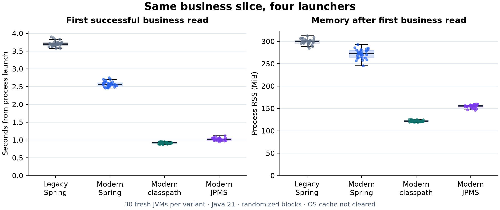

# Matched TeaQL startup and business-workflow results — 2026-10-09

**Historical logging scenario.** The later six-launcher extension found that TeaQL execution SQL traces bypassed framework WARN: modern logs in this campaign contain traces, legacy logs do not. Its read/write observations include that logging difference. Keep this batch intact, and use the separate six-way campaign with explicitly disabled execution logging for the controlled comparison.

The four-variant experiment is complete: 30 fresh JVMs per launcher, with a first nonempty Q query, Platform relation loading, E access, two real updates with readback, and an expected empty weight-report query checked on every run. A separate bounded workload campaign contains five fresh-JVM samples per launcher. The workload is a slice from tanker-filling-service, not its complete 100-file custom business service.

## Startup and memory

All values are medians of 30 runs. Memory is process RSS, not Java heap. Business ready means the first nonempty Merchant read and its relation/E response completed. Settled memory is after both checked writes, the weight query and a ten-second wait.

| Variant | Web ready (s) | Business ready (s) | Web-ready RSS (MiB) | Business-ready RSS (MiB) | Settled RSS (MiB) | Peak through settle (MiB) | CPU to Web ready (CPU-s) |
| --- | ---: | ---: | ---: | ---: | ---: | ---: | ---: |
| Legacy TeaQL / Spring | 3.477 | 3.699 | 292.646 | 299.553 | 298.859 | 310.543 | 11.385 |
| Modern TeaQL / Spring | 2.321 | 2.560 | 261.852 | 272.746 | 274.830 | 285.824 | 7.555 |
| Modern TeaQL / classpath | 0.612 | 0.923 | 97.262 | 121.691 | 149.732 | 172.674 | 1.370 |
| Modern TeaQL / JPMS | 0.714 | 1.017 | 127.750 | 155.691 | 175.162 | 190.689 | 1.880 |

With Spring/Tomcat held at the same versions, the modern stack has 33.2% lower median Web-ready time and 10.5% lower median ready RSS than the legacy stack. This measures the combined runtime, generated-domain packaging and assembly changes. It is not a decomposition of reflection cost.

Changing the modern Spring/Tomcat adapter to the standalone JDK HTTP server reduces median Web-ready time by 73.6% and ready RSS by 62.9%. This includes HTTP-container and lifecycle differences.

For the same StandaloneProbe, JPMS takes 0.102 seconds more to become Web ready and uses 30.49 MiB more ready RSS. The JPMS launch resolves ALL-MODULE-PATH, including unused Spring modules. JPMS is useful here as a dependency/assembly mechanism; this campaign does not show a JPMS startup-speed benefit.

Each dot is one fresh JVM; boxes show quartiles and median. Zero-based axes and all observations are retained. These are warm or uncontrolled OS-cache launches, not cold-machine starts.

## Cold operation costs

These operations occur immediately after Web readiness. The write to 49 is the first update; the write to 48 is the second update and restores the fixture. Both include lookup, persistence and fresh relation/E readback.

| Variant | First read (ms) | First write to 49 (ms) | Second write to 48 (ms) | Web-ready p90 (s) | Business-ready p90 (s) |
| --- | ---: | ---: | ---: | ---: | ---: |
| Legacy TeaQL / Spring | 221.453 | 35.950 | 23.293 | 3.575 | 3.827 |
| Modern TeaQL / Spring | 237.960 | 56.499 | 28.873 | 2.437 | 2.675 |
| Modern TeaQL / classpath | 302.590 | 73.083 | 30.900 | 0.640 | 0.955 |
| Modern TeaQL / JPMS | 299.225 | 67.026 | 32.431 | 0.762 | 1.065 |

Readiness and first-persistence costs are separate observations. The supported write APIs differ: legacy saveGraph versus modern auditAs(...).save. Interpret the measured write costs alongside readiness and bounded warmup results; no internal profiling was collected to attribute them to audit, mapping or JIT work.

## Bounded workload after fixed warmup

Each sample uses a fresh JVM, 200 checked warmup reads and 20 alternating checked warmup writes. Measured workload: 400 reads at concurrency four and 40 alternating writes at concurrency one. There are five samples per variant. RPS is the median sample rate; latency percentiles below pool the equally sized samples (2,000 reads and 200 writes per variant). All values include loopback HTTP/client scheduling and response validation; this is not maximum sustained throughput.

| Variant | Read RPS | Read p50 / p95 (ms) | Write RPS | Write p50 / p95 (ms) |
| --- | ---: | ---: | ---: | ---: |
| Legacy TeaQL / Spring | 195.7 | 17.077 / 70.720 | 53.3 | 18.069 / 20.100 |
| Modern TeaQL / Spring | 193.4 | 17.444 / 60.657 | 46.8 | 19.085 / 25.701 |
| Modern TeaQL / classpath | 196.1 | 16.325 / 66.673 | 47.7 | 19.625 / 25.491 |
| Modern TeaQL / JPMS | 203.6 | 14.846 / 61.188 | 45.2 | 20.296 / 24.353 |

Fixed-warmup read rates are close in this bounded campaign. Modern Spring has a lower median write rate than legacy Spring here; faster readiness should not be presented as a universal read/write speedup.

## What is controlled and what changes

All variants use Corretto 21.0.12.1, Spring Boot 3.2.0 where applicable, Tomcat 10.1.16 where applicable, HikariCP 5.0.1 with minimum/maximum ten connections, PostgreSQL JDBC 42.6.0, Jackson 2.22.3, Xms128m/Xmx512m and one explicit WARN console configuration. Forty-five shared JARs have identical hashes. The old and new distributions contain 91 and 57 JARs respectively. The three modern launchers use the exact same bundle.

Both isolated databases contain one identified Merchant with the same business fields and Platform relation 1. The seven Merchant column names, types and lengths match; the modern schema adds NOT NULL constraints on name, external_id, platform and version. See schema-verification.json. Platform labels retain their generated values (legacy 液体充装系统, modern 液体业务平台); the timed response uses only Platform ID. Separate diagnostics verify each loaded parent name against its direct query. Internal row IDs/revision history and full schemas are not identical: the legacy schema has 56 tables and the modern schema 76. The modern provider creates tables for view descriptors; that behavior needs review before production migration. The regenerated model also includes previously documented constant-ID remapping and reserved-field renaming outside this workflow.

The legacy slice disables Redis auto-configuration and replaces its required DataStore with a process-local adapter; no distributed cache is exercised. General-purpose generated legacy service controllers and GraphQL registry are excluded. Actuator is included in both Spring distributions. Application/domain JARs are automatic modules in the modern module-path trial. Full strong application encapsulation, Android, native image, JSON snapshot round trips, encryption/masking and the original PLC/SMS/auth workflows were not tested.

The old generated library defines 55 Spring repository beans; its EntityMetaRegistry implements InitializingBean. The modern adapter explicitly installs GeneratedRuntimeModule and one PostgreSQL execution provider. Retained binary/source structure supports this architectural distinction, but does not isolate its share of measured startup cost. See [architecture evidence](architecture-evidence/summary.json).

## Method and reproducibility

The host is Debian x86_64 on an Intel i7-4770HQ with approximately 15.5 GiB RAM, PostgreSQL 17.11 in Docker. Thirty randomized blocks each contain all four variants, one JVM at a time, seed 20261009. Polling uses a 20 ms interval; time uses an external monotonic clock. Five additional shuffled blocks perform the fixed-warmup workload.

OS caches are not cleared and CPU frequency is not pinned. The host is shared; PostgreSQL/Redis and earlier idle test services remain running. No JFR/NMT is enabled. Medians and nearest-rank p90 summarize this campaign; latency p95 is descriptive. Results do not establish statistical or production generality across hardware, datasets or workloads.

App branch codex/teaql-1.554-upgrade, source commit 9f3eb84; patched generator commits be6191f4/e1d25552. Those generator changes are local/unreleased, and the published TeaQL 1.554 runtime was not patched. [Build provenance](build-provenance.json) contains all dependency hashes. [Reproduction and scope](README.md), [launcher](start-matched.sh), [collector](collect_matched.py), [preflight](verify_contract.py) and [actual contract responses](contract-verification.json) are retained. Post-campaign checks rejected hours=47 and confirmed unchanged data in all four launchers. [Full relation diagnostic](relation-diagnostics/proof.json) compares E traversal of the actual parent name with a direct root query; its separate source/logs are retained and it was outside timing.

Only the final completed batch is used. Earlier incomplete batches stopped during adapter/dependency preparation are excluded. The older Java 17 full-service baseline and earlier modern reduced probe are separate campaigns and are not pooled with these measurements.

## Raw evidence

- [Startup CSV](results-20261009-194054/startup.csv), [startup summary](results-20261009-194054/startup-summary.json).
- [Load CSV](results-20261009-194054/load.csv), [load summary](results-20261009-194054/load-summary.json).
- [Environment and deployed JAR hashes](results-20261009-194054/environment.json).
- The result directory contains 120 startup logs, 20 workload logs and 20 raw per-request latency files.
